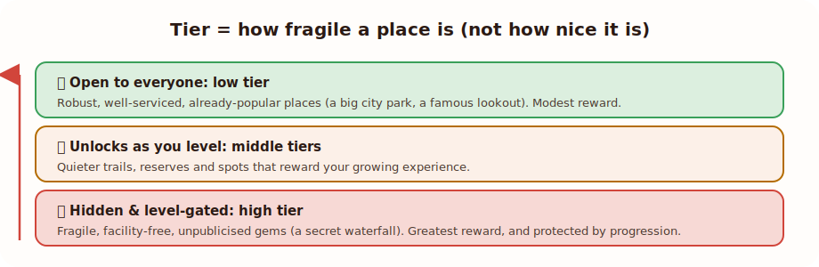

Locatour's progression is inspired by the slow, satisfying grind of classic
role-playing games. Early levels come quickly; the highest levels are a genuine
long-term adventure that very few will ever max out. Here's how it fits together,
at a glance.

## Experience and levels

Every check-in earns you **experience**. Accumulate enough and you climb to the
next **level**. Like the RPGs that inspired it:

- **The early levels fly by.** A handful of check-ins and you're already moving
  up, and you'll feel progress straight away.
- **The later levels are a real journey.** Each level asks more than the last,
  so reaching the top is a long, rewarding grind rather than a weekend's work.
  That's by design: there should always be a horizon ahead of you.

## Location tiers

Every place has a **tier** that reflects how robust or fragile it is, from
open-to-everyone all the way up to the most delicate hidden gems. (Tier is
about protection and carrying capacity, **not** how nice a place is: a famous
park can be a low tier, a secret waterfall a high one. See [Hidden
locations](/play/hidden-locations/).)

As you level up, you **unlock higher tiers**, and the places in them appear on
your map. Lower-tier places are open to everyone; the highest tiers are reserved
for the most invested explorers.

## How levels and tiers connect

Put simply:

- **Level up by checking in.** More remote, higher-tier places reward more
  experience than easy ones.
- **Unlocking levels reveals higher tiers.** The further you progress, the more
  of the map, and the more hidden places, open up to you.
- **The cooldown keeps it honest.** After checking in somewhere, there's a wait
  before that same place rewards you again. That nudges you to keep exploring
  new places rather than farming one, which is exactly how you climb.

## The shape of the journey

Most players will spend their time in the friendly, fast-moving early-to-middle
stretch, and that's a great place to be, full of new places to discover. The
top end exists for the dedicated few who want to chase it over months and years.
Either way, there's always somewhere new just past your current reach.

:::note
We keep the exact experience numbers and tier thresholds under the hood. The
short version: keep visiting new and varied places, and you'll keep climbing.
:::

Next: [Rewards & recognition →](/play/rewards/)
